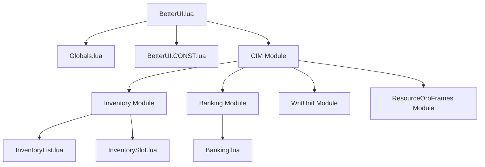
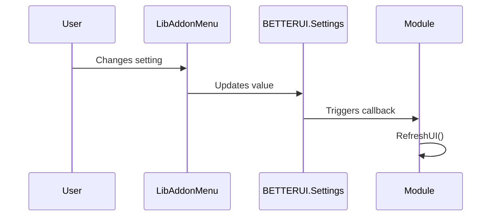

# BetterUI Architecture Overview

> **Audience**: Human developers and AI agents working on the BetterUI codebase.
> **Last Updated**: 2026-01-16

---

## 1. Project Summary

**BetterUI** is an Elder Scrolls Online (ESO) addon that enhances the gamepad interface. It provides improved Inventory, Banking, Tooltip, and Writ tracking experiences through custom UI components and streamlined interactions.

**Key Technologies**:
- **Lua 5.1** (ESO's embedded scripting language)
- **ESO UI Framework** (XML-defined controls, ZO_Object class system)
- **LibAddonMenu2 (LAM)** for settings panels

---

## 2. High-Level Architecture

```
┌─────────────────────────────────────────────────────────────────────────┐
│                           BetterUI Addon                                │
├─────────────────────────────────────────────────────────────────────────┤
│  Entry Point: BetterUI.lua                                              │
│  ├── EVENT_ADD_ON_LOADED → BETTERUI.Initialize()                        │
│  ├── Loads SavedVariables (BetterUISavedVars)                           │
│  └── Calls Module.Setup() for each enabled module                       │
├─────────────────────────────────────────────────────────────────────────┤
│  Core Layer                                                             │
│  ├── Globals.lua          (Namespace init, utility functions)           │
│  ├── BetterUI.CONST.lua   (UI const, currency config, header layouts)   │
│  └── BetterUI_Shared.xml  (Shared XML templates & styles)               │
├─────────────────────────────────────────────────────────────────────────┤
│  Common Interface Module (CIM)                                          │
│  ├── GenericHeader.lua/.xml   (Tab bar header with LB/RB navigation)    │
│  ├── GenericFooter.lua/.xml   (Currency display footer)                 │
│  ├── InterfaceLibrary.lua/.xml (Base window templates)                  │
│  ├── Lists/                   (Enhanced Vertical/Horizontal/TabBar lists)│
│  ├── Tooltips/                (Enhanced item tooltips)                  │
│  └── Nameplates/              (Font customization)                      │
├─────────────────────────────────────────────────────────────────────────┤
│  Feature Modules                                                        │
│  ├── Inventory/   (Enhanced inventory with categories, search, icons)   │
│  ├── Banking/     (Bank/Guild Bank/House Bank interface)                │
│  ├── Banking/     (Bank/Guild Bank/House Bank interface)                │
│  ├── ResourceOrbFrames/ (Custom Health/Magicka/Stamina Orbs)            │
│  └── WritUnit/    (Writ quest tracking panel)                           │
└─────────────────────────────────────────────────────────────────────────┘
```

---

## 3. File Loading Order

The ESO client loads files in the order specified in `BetterUI.txt`. **Order matters** for dependency resolution.

| Load Phase | Files | Purpose |
|------------|-------|---------|
| 1. Globals | `Globals.lua` | Initialize `BETTERUI` namespace |
| 2. Localization | `lang/en.lua`, `lang/$(language).lua` | String tables |
| 3. Constants | `BetterUI.CONST.lua` | UI dimensions, currency config |
| 4. Shared XML | `BetterUI_Shared.xml` | Base templates |
| 5. CIM Module | `Modules/CIM/*` | Shared UI and Runtime overrides (starts with `RuntimeSetup.lua`) |
| 6. Feature Modules | `Modules/Inventory/*`, `Modules/Banking/*`, etc. | Dependent on CIM |
| 7. Entry Point | `BetterUI.lua` | `EVENT_ADD_ON_LOADED` handler (Delegates to `RuntimeSetup`) |

> **Critical**: CIM must load before Inventory/Banking because they inherit from CIM templates.

---

## 4. Namespace Structure

All addon code lives under the global `BETTERUI` table, defined in `Globals.lua`.

```lua
BETTERUI = {
    -- Metadata
    name = "BetterUI",
    version = "2.93",

    -- ESO API Caches
    WindowManager = GetWindowManager(),
    EventManager = GetEventManager(),

    -- Core Subsystems
    CONST = {},              -- Constants (BetterUI.CONST.lua)
    CIM = {                  -- Common Interface Module
        CONST = {},          -- CIM-specific constants (header, footer, tooltip geometry)
    },
    Interface = {            -- Base UI utilities
        Window = {},         -- Window class (InterfaceLibrary.lua)
    },
    GenericHeader = {},      -- Header management
    GenericFooter = {},      -- Footer/currency display

    -- Feature Modules
    Inventory = {
        Class = {},          -- Main inventory logic
        List = {},           -- List rendering
    },
    Banking = {
        Class = {},          -- Banking logic
    },
    Tooltips = {},           -- Tooltip enhancements
    Nameplates = {},         -- Nameplate customization
    Writs = {
        List = {},           -- Writ tracking
    },

    -- Settings
    Settings = {},           -- Runtime settings (loaded from SavedVariables)
    DefaultSettings = {},    -- Default values template
    SavedVars = {},          -- Raw SavedVariables reference
}
```

---

## 5. Module Quick Reference

| Module | Entry Point | Key Class | Dependencies | Purpose |
|--------|-------------|-----------|--------------|---------|
| **CIM** | `Module.lua` | `BETTERUI.Interface.Window` | None | Shared UI templates, List classes, Tooltips, Nameplates |
| **ResourceOrbFrames**| `Module.lua` | — | CIM | Custom Health/Magicka/Stamina Orbs |
| **Inventory** | `Module.lua` | `BETTERUI.Inventory.Class` | CIM | Enhanced inventory with categories |
| **Banking** | `Module.lua` | `BETTERUI.Banking.Class` | CIM | Bank/House Bank interface |
| **WritUnit** | `Module.lua` | — | CIM | Writ quest tracker |

---

## 6. Common Code Patterns

### 6.1 ZO_Object Subclassing
ESO uses a prototype-based OOP system via `ZO_Object`.

```lua
-- Define a new class
BETTERUI.MyClass = ZO_Object:Subclass()

-- Constructor (factory method)
function BETTERUI.MyClass:New(...)
    local obj = ZO_Object.New(self)
    obj:Initialize(...)
    return obj
end

-- Initialization logic
function BETTERUI.MyClass:Initialize(param1)
    self.data = param1
end
```

### 6.2 Module Setup Pattern
Each module has a `Setup()` function called by `BetterUI.lua`:

```lua
function BETTERUI.MyModule.Setup()
    -- 1. Register settings panel
    Init("ModuleId", "Module Display Name")
    -- 2. Initialize runtime state
    BETTERUI.MyModule.Init()
end
```

### 6.3 Scene Fragment Pattern
UI visibility is controlled via Scene Fragments:

```lua
-- Create a fragment for a control
self.fragment = ZO_SimpleSceneFragment:New(self.control)
-- Add to a scene
SCENE_MANAGER:GetScene("sceneName"):AddFragment(self.fragment)
```

### 6.4 Parametric Scroll List Pattern
Gamepad lists use `ZO_ParametricScrollList`:

```lua
self.list = BETTERUI.Interface.ParametricScrollList:New(control)
self.list:AddDataTemplate("TemplateName", SetupFunction, HeaderSetup)
self.list:AddEntry("TemplateName", entryData)
self.list:Commit()
```

### 6.5 Settings Accessor Pattern
Modules use `BETTERUI.CreateSettingAccessors` to generate `getFunc`/`setFunc` pairs for LAM, reducing boilerplate and ensuring nil-safety.

```lua
-- In Module.Init:
local GetSet = BETTERUI.CreateSettingAccessors("ModuleName", ApplyCallback)
local getScale, setScale = GetSet("scale", 1.0)

local options = {
    {
        type = "slider",
        getFunc = getScale,
        setFunc = setScale,
    }
}
```

---

## 7. External Dependencies

| Dependency | Required | Purpose | Reference |
|------------|----------|---------|-----------|
| **LibAddonMenu-2.0** | Yes | Settings panels | [ESOUI](https://www.esoui.com/downloads/info7-LibAddonMenu.html) |
| **LibDebugLogger** | Optional | Advanced logging | [ESOUI](https://www.esoui.com/downloads/info2275-LibDebugLogger.html) |
| **AutoCategory** | Optional | Custom category integration | External addon |
| **MasterMerchant** | Optional | Price data in tooltips | External addon |
| **TamrielTradeCentre** | Optional | Price data in tooltips | External addon |
| **ArkadiusTradeTools** | Optional | Price data in tooltips | External addon |

---

## 8. Glossary of Terms

| Term | Definition |
|------|------------|
| **CIM** | Common Interface Module — shared UI components |
| **LAM** | LibAddonMenu2 — settings framework |
| **Parametric List** | ZOS's gamepad scrolling list with focus tracking |
| **Tab Bar / Carousel** | LB/RB-navigable header for category switching |
| **Scene** | ESO's visibility state system (e.g., `gamepad_inventory_root`) |
| **Fragment** | A UI element tied to a Scene's visibility |
| **SavedVariables** | Persistent player settings (stored in `BetterUISavedVars`) |
| **SlotType** | ESO constant identifying item context (e.g., `SLOT_TYPE_BANK_ITEM`) |

---

## 9. Data Flow Example: Opening Inventory

```
1. Player presses Menu button
2. SCENE_MANAGER activates "gamepad_inventory_root" scene
3. BETTERUI.Inventory.Class detects scene state change (via callback)
4. :RefreshList() is called:
   a. Queries SHARED_INVENTORY for bag slots
   b. Applies category filters (custom/AutoCategory)
   c. Sorts items
   d. Populates ZO_ParametricScrollList
5. GenericHeader updates with current category tabs
6. GenericFooter refreshes currency values
7. Keybind strip updates with available actions
```

---

## 10. Key Files Reference

| File | Lines | Purpose |
|------|-------|---------|
| `BetterUI.lua` | ~400 | Entry point, module loading |
| `Globals.lua` | ~370 | Namespace, utilities |
| `BetterUI.CONST.lua` | ~500 | Constants, currency config |
| `Modules/CIM/RuntimeSetup.lua` | ~300 | API patches, migrations, and initialization delegation |
| `Modules/CIM/SettingsAccessor.lua` | ~100 | Settings get/set factory |
| `Modules/CIM/InterfaceLibrary.lua` | ~600 | Base Window class |
| `Modules/Inventory/Inventory.lua` | ~2000 | Main inventory logic |
| `Modules/Banking/Banking.lua` | ~2500 | Banking interface |
| `Modules/ResourceOrbFrames/Module.lua` | ~1000 | Resource Orbs settings & init |

---

## 11. Diagrams

### Module Dependency Graph



### Settings Flow



