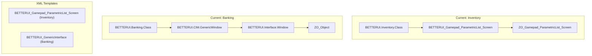
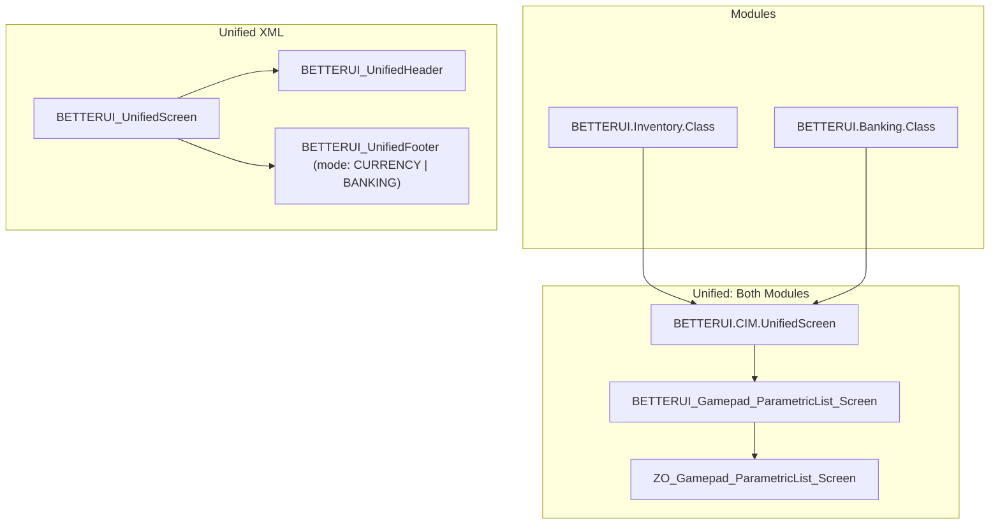

# UI Layout Consolidation: Full Template Unification

Complete unification of Inventory and Banking UI layouts including XML templates, class hierarchy, and constants.

---

## Current Architecture



### Template Comparison

| Component | Inventory Template | Banking Template | Gap |
|-----------|-------------------|------------------|-----|
| **Root** | `BETTERUI_Gamepad_ParametricList_Screen` | `BETTERUI_GenericInterface` | Different structures |
| **Header** | `BETTERUI_GamepadGenericScreenHeader` | `BETTERUI_GenericInterfaceHeader` | Similar but separate |
| **Footer** | `BETTERUI_GamepadGenericScreenFooter` (currencies) | `BETTERUI_GenericInterfaceFooter` (Withdraw/Deposit) | Different content |
| **List Container** | `BETTERUI_Gamepad_ParametricList_Screen_ListContainer` | Inline in parent | Different anchoring |

---

## Target Architecture



---

## Implementation Phases

### Phase 1: Consolidate Layout Constants

Migrate divergent constants to unified CIM values.

#### [MODIFY] [CIM/Constants.lua](file:///x:/Git/BetterUI/Modules/CIM/Constants.lua)

Add unified screen layout constants:

```lua
BETTERUI.CIM.CONST.SCREEN = {
    SEARCH = {
        X_OFFSET = 56,
        Y_OFFSET = 8,
        RIGHT_INSET = -6,
    },
    LIST = {
        HEADER_X_OFFSET = -50,
        HEADER_Y_OFFSET = -25,
        FOOTER_Y_OFFSET = 10,
    },
    ICON = {
        SIZE_SMALL = 16,
        SIZE_MEDIUM = 24,
        SIZE_LARGE = 34,
    },
}
```

#### [MODIFY] [Inventory/Constants.lua](file:///x:/Git/BetterUI/Modules/Inventory/Constants.lua)

Delegate to CIM shared values.

#### [MODIFY] [Banking/Constants.lua](file:///x:/Git/BetterUI/Modules/Banking/Constants.lua)

Delegate to CIM shared values, remove carousel overrides.

---

### Phase 2: Create Unified Footer Template

Create a single footer template that supports multiple content modes.

#### [NEW] [CIM/Templates/UnifiedFooter.xml](file:///x:/Git/BetterUI/Modules/CIM/Templates/UnifiedFooter.xml)

```xml
<Control name="BETTERUI_UnifiedFooter" virtual="true">
    <!-- Mode 1: Currency display (Inventory) -->
    <Control name="$(parent)CurrencyContent" hidden="false">
        <!-- Currency labels from GenericFooter.xml -->
    </Control>
    
    <!-- Mode 2: Banking controls (Withdraw/Deposit) -->
    <Control name="$(parent)BankingContent" hidden="true">
        <!-- Withdraw/Deposit from GenericInterfaceFooter -->
    </Control>
</Control>
```

#### [NEW] [CIM/UI/UnifiedFooter.lua](file:///x:/Git/BetterUI/Modules/CIM/UI/UnifiedFooter.lua)

```lua
BETTERUI.CIM.CONST.FOOTER_MODE = {
    CURRENCY = 1,
    BANKING = 2,
}

function BETTERUI.UnifiedFooter:SetMode(mode)
    local currencyContent = self.footer:GetNamedChild("CurrencyContent")
    local bankingContent = self.footer:GetNamedChild("BankingContent")
    
    if mode == BETTERUI.CIM.CONST.FOOTER_MODE.CURRENCY then
        currencyContent:SetHidden(false)
        bankingContent:SetHidden(true)
    else
        currencyContent:SetHidden(true)
        bankingContent:SetHidden(false)
    end
end
```

---

### Phase 3: Create Unified Screen Template

Consolidate `BETTERUI_Gamepad_ParametricList_Screen` and `BETTERUI_GenericInterface` into one.

#### [MODIFY] [CIM/Templates/ParametricScrollListTemplates.xml](file:///x:/Git/BetterUI/Modules/CIM/Templates/ParametricScrollListTemplates.xml)

Update `BETTERUI_Gamepad_ParametricList_Screen` to use unified footer:

```diff
 <Control name="BETTERUI_Gamepad_ParametricList_Screen" ...>
     <Controls>
         ...
         <Control name="$(parent)FooterContainer"
-            inherits="BETTERUI_GamepadScreenFooterContainer ..."/>
+            inherits="BETTERUI_UnifiedFooter ..."/>
     </Controls>
 </Control>
```

---

### Phase 4: Create Unified Screen Base Class

#### [NEW] [CIM/Core/UnifiedScreen.lua](file:///x:/Git/BetterUI/Modules/CIM/Core/UnifiedScreen.lua)

```lua
BETTERUI.CIM.UnifiedScreen = BETTERUI_Gamepad_ParametricList_Screen:Subclass()

function BETTERUI.CIM.UnifiedScreen:Initialize(control, footerMode, ...)
    BETTERUI_Gamepad_ParametricList_Screen.Initialize(self, control, ...)
    
    -- Configure footer mode
    self.footerMode = footerMode or BETTERUI.CIM.CONST.FOOTER_MODE.CURRENCY
    self:SetFooterMode(self.footerMode)
end

function BETTERUI.CIM.UnifiedScreen:SetFooterMode(mode)
    BETTERUI.UnifiedFooter.SetMode(self, mode)
end
```

---

### Phase 5: Migrate Banking to Unified Template

#### [NEW] [Banking/Templates/BankingScreen.xml](file:///x:/Git/BetterUI/Modules/Banking/Templates/BankingScreen.xml)

Create Banking-specific instantiation of unified template:

```xml
<TopLevelControl name="BETTERUI_BankingTopLevel"
    inherits="BETTERUI_Gamepad_ParametricList_Screen">
    <!-- Banking-specific footer mode is set in Lua -->
</TopLevelControl>
```

#### [MODIFY] [Banking/Core/BankingClass.lua](file:///x:/Git/BetterUI/Modules/Banking/Core/BankingClass.lua)

```diff
-BETTERUI.Banking.Class = BETTERUI.CIM.GenericWindow:Subclass()
+BETTERUI.Banking.Class = BETTERUI.CIM.UnifiedScreen:Subclass()

 function BETTERUI.Banking.Class:Initialize(tlw_name, scene_name)
-    BETTERUI.CIM.GenericWindow.Initialize(self, tlw_name, scene_name)
+    BETTERUI.CIM.UnifiedScreen.Initialize(
+        self,
+        BETTERUI_BankingTopLevel,
+        BETTERUI.CIM.CONST.FOOTER_MODE.BANKING
+    )
     ...
 end
```

#### [MODIFY] [Banking/Banking.lua](file:///x:/Git/BetterUI/Modules/Banking/Banking.lua)

Update initialization to use new template structure (significant refactoring of control lookups).

---

### Phase 6: Migrate Inventory to Unified Base

#### [MODIFY] [Inventory/Core/InventoryClass.lua](file:///x:/Git/BetterUI/Modules/Inventory/Core/InventoryClass.lua)

```diff
-function BETTERUI.Inventory.Class:Initialize(control)
+function BETTERUI.Inventory.Class:Initialize(control)
+    BETTERUI.CIM.UnifiedScreen.Initialize(
+        self,
+        control,
+        BETTERUI.CIM.CONST.FOOTER_MODE.CURRENCY
+    )
     ...
```

---

### Phase 7: Deprecate Legacy Templates

#### [DELETE] Legacy files after migration verified

- `CIM/Templates/InterfaceLibrary.xml` → `BETTERUI_GenericInterface` section (keep other utilities)
- `CIM/Core/WindowClass.lua` → Functionality merged into `UnifiedScreen.lua`

---

## File Summary

| Phase | Action | File |
|-------|--------|------|
| 1 | MODIFY | `CIM/Constants.lua` |
| 1 | MODIFY | `Inventory/Constants.lua` |
| 1 | MODIFY | `Banking/Constants.lua` |
| 2 | NEW | `CIM/Templates/UnifiedFooter.xml` |
| 2 | NEW | `CIM/UI/UnifiedFooter.lua` |
| 2 | MODIFY | `CIM/Templates/GenericFooter.xml` - Migrate content |
| 3 | MODIFY | `CIM/Templates/ParametricScrollListTemplates.xml` |
| 4 | NEW | `CIM/Core/UnifiedScreen.lua` |
| 5 | NEW | `Banking/Templates/BankingScreen.xml` |
| 5 | MODIFY | `Banking/Core/BankingClass.lua` |
| 5 | MODIFY | `Banking/Banking.lua` |
| 6 | MODIFY | `Inventory/Core/InventoryClass.lua` |
| 7 | MODIFY | `CIM/Templates/InterfaceLibrary.xml` |
| 7 | DELETE | Parts of `CIM/Core/WindowClass.lua` |

---

## Verification Plan

### Automated
```powershell
# Syntax check all modified Lua files
Get-ChildItem -Path "x:\Git\BetterUI\Modules" -Recurse -Filter "*.lua" | 
    ForEach-Object { luac -p $_.FullName }
```

### Manual Testing

**Test 1: Inventory Functionality**
1. Open Inventory (Start button)
2. Navigate categories with LB/RB
3. Search with text filter
4. Select items, verify tooltip
5. Check currency footer displays correctly

**Test 2: Banking Functionality**
1. Visit bank NPC
2. Verify Withdraw/Deposit mode toggle works
3. Navigate categories
4. Search items
5. Deposit/withdraw operations
6. Check footer buttons function correctly

**Test 3: Visual Comparison**
- Screenshot both screens
- Verify: divider position, tab bar alignment, search box position, list start position, icon sizes

---

## Risk Mitigation

> [!WARNING]
> **High-Risk Changes**: Banking class inheritance change requires careful testing of all Banking functionality.

**Rollback Strategy:**
1. Create Git branch `feature/ui-unification` before starting
2. Implement in phases with commits between each
3. Phase 5 (Banking migration) should be a separate PR

**Incremental Testing:**
- Test after each phase before proceeding
- Phases 1-4 are low-risk (additive)
- Phases 5-6 are high-risk (refactoring)
