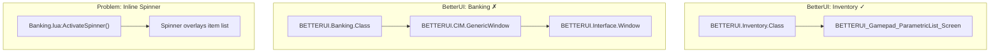

# UI Layout Consolidation: Full Template Unification

Complete unification of Inventory and Banking UI layouts including XML templates, class hierarchy, constants, and improved quantity selection dialogs.

---

## Executive Summary

**Goals**:
1. Achieve visual and structural consistency between Inventory and Banking modules
2. Replace inline Banking spinner with proper modal dialog for quantity selection

**Key Findings from ESO API Research**:
- ESO native uses `GAMEPAD_DIALOGS.ITEM_SLIDER` for quantity selection (see `gamepadinventory.lua:546-605`)
- BetterUI Inventory already uses this pattern correctly (`Inventory.lua:588`)
- Banking uses inline spinner overlay on item list (inelegant, confusing UX)
- Both ESO native modules inherit from `ZO_Gamepad_ParametricList_BagsSearch_Screen`
- BetterUI Banking diverges by using custom `BETTERUI.Interface.Window`

---

## Current Architecture



---

## Implementation Phases

### Phase 1: Consolidate Layout Constants

#### [MODIFY] [CIM/Constants.lua](file:///x:/Git/BetterUI/Modules/CIM/Constants.lua)

Add `BETTERUI.CIM.CONST.SCREEN` with unified search, icon, and spinner dimensions.

#### [MODIFY] [Inventory/Constants.lua](file:///x:/Git/BetterUI/Modules/Inventory/Constants.lua) / [Banking/Constants.lua](file:///x:/Git/BetterUI/Modules/Banking/Constants.lua)

Delegate to CIM shared values.

---

### Phase 2: Create Banking Quantity Dialog

> [!IMPORTANT]
> **User Request**: Replace inline spinner with proper modal dialog for withdraw/deposit quantity selection.

#### [NEW] [Banking/Dialogs/QuantityDialog.lua](file:///x:/Git/BetterUI/Modules/Banking/Dialogs/QuantityDialog.lua)

Create `BETTERUI_BANK_QUANTITY_DIALOG` using ESO's `GAMEPAD_DIALOGS.ITEM_SLIDER` pattern:

```lua
BETTERUI_BANK_QUANTITY_DIALOG = "BETTERUI_BANK_QUANTITY_DIALOG"

function BETTERUI.Banking.InitializeQuantityDialog()
    ZO_Dialogs_RegisterCustomDialog(BETTERUI_BANK_QUANTITY_DIALOG, {
        canQueue = true,
        gamepadInfo = {
            dialogType = GAMEPAD_DIALOGS.ITEM_SLIDER,
        },
        title = {
            text = function(dialog)
                return dialog.data.isDeposit 
                    and GetString(SI_BETTERUI_BANK_DEPOSIT_QUANTITY)
                    or GetString(SI_BETTERUI_BANK_WITHDRAW_QUANTITY)
            end,
        },
        mainText = {
            text = SI_GAMEPAD_INVENTORY_SPLIT_STACK_PROMPT,
        },
        OnSliderValueChanged = function(dialog, sliderControl, value)
            dialog.sliderValue1:SetText(dialog.data.stackSize - value)
            dialog.sliderValue2:SetText(value)
        end,
        buttons = {
            { keybind = "DIALOG_NEGATIVE", text = SI_DIALOG_CANCEL },
            {
                keybind = "DIALOG_PRIMARY",
                text = SI_GAMEPAD_SELECT_OPTION,
                callback = function(dialog)
                    local data = dialog.data
                    local quantity = ZO_GenericGamepadItemSliderDialogTemplate_GetSliderValue(dialog)
                    BETTERUI.Banking.Window:MoveItem(data.list, quantity)
                    CALLBACK_MANAGER:FireCallbacks("BETTERUI_EVENT_SPLIT_STACK_DIALOG_FINISHED")
                end,
            },
        },
    })
end
```

#### [MODIFY] [Banking/Banking.lua](file:///x:/Git/BetterUI/Modules/Banking/Banking.lua)

Replace `ActivateSpinner`/`DeactivateSpinner` with dialog:

```diff
-function BETTERUI.Banking.Class:ActivateSpinner()
-    self.spinner:SetHidden(false)
-    self.spinner:Activate()
-    ...
-end

+function BETTERUI.Banking.Class:ShowQuantityDialog(isDeposit)
+    local targetData = self:GetList().selectedData
+    if not targetData then return end
+    
+    ZO_Dialogs_ShowGamepadDialog(BETTERUI_BANK_QUANTITY_DIALOG, {
+        bagId = targetData.bagId,
+        slotIndex = targetData.slotIndex,
+        stackSize = targetData.stackCount or 1,
+        isDeposit = isDeposit,
+        list = self:GetList(),
+    })
+end
```

#### [NEW] Localization strings

Add to `lang/en.lua`:
- `SI_BETTERUI_BANK_DEPOSIT_QUANTITY = "Deposit How Many?"`
- `SI_BETTERUI_BANK_WITHDRAW_QUANTITY = "Withdraw How Many?"`

---

### Phase 3: Extract Spinner Templates (Cleanup)

#### [MODIFY] [InterfaceLibrary.xml](file:///x:/Git/BetterUI/Modules/CIM/Templates/InterfaceLibrary.xml)

Remove inline spinner from `BETTERUI_GenericInterface` footer (no longer needed for Banking).

Keep currency selector templates for gold deposit/withdraw.

---

### Phase 4: Create Unified Footer Template

#### [NEW] [UnifiedFooter.xml](file:///x:/Git/BetterUI/Modules/CIM/Templates/UnifiedFooter.xml) + [UnifiedFooter.lua](file:///x:/Git/BetterUI/Modules/CIM/UI/UnifiedFooter.lua)

Single footer with mode switching: `CURRENCY` (Inventory) vs `BANKING` (Withdraw/Deposit buttons).

---

### Phase 5: Update Screen Template

#### [MODIFY] [ParametricScrollListTemplates.xml](file:///x:/Git/BetterUI/Modules/CIM/Templates/ParametricScrollListTemplates.xml)

Integrate unified footer.

---

### Phase 6: Create Unified Base Class

#### [NEW] [UnifiedScreen.lua](file:///x:/Git/BetterUI/Modules/CIM/Core/UnifiedScreen.lua)

Common parent for Inventory and Banking with footer mode configuration.

---

### Phase 7: Migrate Inventory (LOW RISK)

#### [MODIFY] [InventoryClass.lua](file:///x:/Git/BetterUI/Modules/Inventory/Core/InventoryClass.lua)

Inherit from `BETTERUI.CIM.UnifiedScreen`.

---

### Phase 8: Migrate Banking (HIGH RISK)

> [!WARNING]
> Significant refactoring required.

#### [NEW] [BankingScreen.xml](file:///x:/Git/BetterUI/Modules/Banking/Templates/BankingScreen.xml)

#### [MODIFY] [BankingClass.lua](file:///x:/Git/BetterUI/Modules/Banking/Core/BankingClass.lua)

Inherit from `BETTERUI.CIM.UnifiedScreen`, remove spinner logic.

---

### Phase 9: Deprecate Legacy Templates

Remove `BETTERUI_GenericInterface`, migrate `WindowClass.lua` utilities.

---

### Phase 10: Update Manifest

Add new files to `BetterUI.txt` in correct load order.

---

## File Summary

| Phase | Action | File |
|-------|--------|------|
| 1 | MODIFY | `CIM/Constants.lua`, `Inventory/Constants.lua`, `Banking/Constants.lua` |
| 2 | NEW | `Banking/Dialogs/QuantityDialog.lua` |
| 2 | MODIFY | `Banking/Banking.lua` (remove inline spinner) |
| 2 | MODIFY | `lang/en.lua` (add strings) |
| 3 | MODIFY | `CIM/Templates/InterfaceLibrary.xml` |
| 4 | NEW | `CIM/Templates/UnifiedFooter.xml`, `CIM/UI/UnifiedFooter.lua` |
| 5 | MODIFY | `CIM/Templates/ParametricScrollListTemplates.xml` |
| 6 | NEW | `CIM/Core/UnifiedScreen.lua` |
| 7 | MODIFY | `Inventory/Core/InventoryClass.lua` |
| 8 | NEW | `Banking/Templates/BankingScreen.xml` |
| 8 | MODIFY | `Banking/Core/BankingClass.lua`, `Banking/Banking.lua` |
| 9 | MODIFY | `CIM/Templates/InterfaceLibrary.xml`, `CIM/Core/WindowClass.lua` |
| 10 | MODIFY | `BetterUI.txt` |

---

## Verification Plan

### Per-Phase
- **Phase 2**: Test quantity dialog for deposit/withdraw partial stacks
- **Phases 7-8**: Full module functionality tests

### Final
1. Screenshot comparison of both UIs
2. All banking operations work correctly
3. No inline spinner visible on item list
