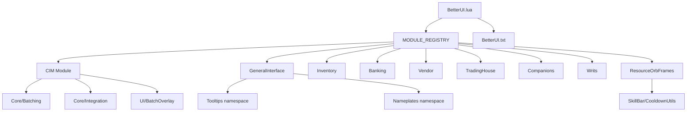
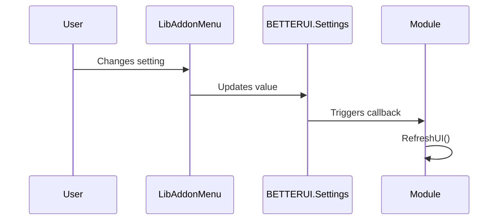

# BetterUI Architecture Overview

> **Audience**: Developers working on the BetterUI codebase.
> **Last Updated**: 2026-04-21

---

## 1. Project Summary

**BetterUI** is an Elder Scrolls Online (ESO) addon that enhances the gamepad interface. It provides improved Inventory, Banking, Vendor, Tooltip, Resource Orb, and Writ tracking experiences through custom UI components and streamlined interactions.

**Key Technologies**:
- **Lua 5.1** (ESO's embedded scripting language)
- **ESO UI Framework** (XML-defined controls, ZO_Object class system)
- **LibAddonMenu2 (LAM)** for settings panels

---

## 2. High-Level Architecture

```
┌─────────────────────────────────────────────────────────────────────────┐
│                           BetterUI Addon                                │
├─────────────────────────────────────────────────────────────────────────┤
│  Entry Point: BetterUI.lua                                              │
│  ├── EVENT_ADD_ON_LOADED → BETTERUI.Initialize()                        │
│  ├── Loads SavedVariables (BetterUISavedVars)                           │
│  ├── Applies CIM.RuntimeSetup.Apply()                                   │
│  └── Walks MODULE_REGISTRY → ValidateAndSetupModule()                   │
├─────────────────────────────────────────────────────────────────────────┤
│  Load Manifest: BetterUI.txt                                            │
│  ├── CIM shared infrastructure loads first                              │
│  ├── GeneralInterface loads tooltip/nameplate services                  │
│  └── Feature modules load in manifest order, then setup is registry-led │
├─────────────────────────────────────────────────────────────────────────┤
│  Core Layer (inside CIM module)                                         │
│  ├── CIM/Constants.lua    (Namespace init, constants, timing)           │
│  ├── CIM/ConstantsUI.lua  (UI const, currency config, header layouts)   │
│  ├── Core/Batching/      (BatchConfig, BatchActions, MultiSelect*)      │
│  ├── Core/Integration/   (MarketIntegration, ResearchCache, Hooks)      │
│  ├── UI/BatchOverlay.lua (Batch status overlay UI)                      │
│  └── Templates/SharedTemplates.xml (Shared XML templates & styles)      │
├─────────────────────────────────────────────────────────────────────────┤
│  Common Interface Module (CIM)  [Modules/CIM/]                          │
│  ├── Constants.lua + Module.lua (root contract + shared init)           │
│  ├── Core/       (Batching, Data, Diagnostics, Lifecycle, Window, etc.) │
│  ├── UI/         (BatchOverlay, headers, footers, sort/scroll helpers)  │
│  ├── Lists/      (ItemDataProcessor, ListRefreshManager, templates)     │
│  ├── Actions/    (GenericSlotActions, ActionDialogUtils)                │
│  ├── Keybinds/   (Generic keybind helpers)                              │
│  └── Templates/  (Shared XML templates)                                 │
├─────────────────────────────────────────────────────────────────────────┤
│  Interface Enhancements [Modules/GeneralInterface/]                      │
│  ├── Tooltips/   (BETTERUI.GeneralInterface.Tooltips runtime/settings)  │
│  ├── Nameplates/ (BETTERUI.GeneralInterface.Nameplates runtime/settings)  │
│  └── Setup.lua   (Aggregates settings + runtime hooks)                  │
├─────────────────────────────────────────────────────────────────────────┤
│  Feature Modules                                                         │
│  ├── Inventory/         (Enhanced inventory with categories, search)    │
│  ├── Banking/           (Bank/Guild Bank/House Bank interface)          │
│  ├── Vendor/            (Store/fence interface enhancements)            │
│  ├── TradingHouse/      (Trading House scaffold/runtime surface)        │
│  ├── Companions/        (Companion gear and inventory surfaces)         │
│  ├── ResourceOrbFrames/ (Custom Health/Magicka/Stamina Orbs + SkillBar) │
│  └── Writs/             (Writ quest tracking panel)                     │
└─────────────────────────────────────────────────────────────────────────┘
```

---

## 3. Minimal Root Module Structure

Modules now document root ownership explicitly. Runtime-facing roots that opt into the standard contract expose:

| Metadata | Purpose |
|----------|---------|
| `ARCHETYPE` | Declares the module's root role (`runtime-coordinator`, `settings-owner`, `thin-entrypoint`) |
| `ROOT_CONTRACT` | Records who owns init, setup, runtime, and settings responsibilities |

Current module examples in the repo:

- **`runtime-coordinator`** — `CIM`, `Inventory`, `Banking`, `Vendor`, `TradingHouse`, `Companions`
- **`settings-owner`** — `ResourceOrbFrames`
- **`thin-entrypoint`** — `GeneralInterface`, `Writs`

The root remains intentionally small, but a module may keep one public runtime façade at the root when that file is the canonical owner of gameplay flow.

| Root Files | Purpose |
|------------|---------|
| `Module.lua` | Public init/setup hook, root contract, settings registration |
| `Constants.lua` | Module-specific constants and configuration (when needed) |
| `<Module>.lua` | Public runtime façade/class when the module keeps one at the root |

All other files are organized into subfolders by responsibility:

| Subfolder | Purpose | Examples |
|-----------|---------|----------|
| `Core/` | Core logic, utilities, integrations | `Utils.lua`, `RuntimeSetup.lua` |
| `UI/` | Visual components, headers, footers | `GenericHeader.lua`, `TooltipUtils.lua` |
| `Lists/` | List management, templates | `ItemListManager.lua`, `BankListManager.lua` |
| `Actions/` | Action discovery, dialogs | `TransferActions.lua`, `ActionDialogHooks.lua` |
| `Keybinds/` | Keybind descriptors and management | `KeybindManager.lua` |
| `State/` | State management, mode tracking | `StateManager.lua` |
| `Settings/` | LAM settings panel definitions | `CurrencySettings.lua` |
| `Search/` | Search functionality | `SearchManager.lua` |
| `Templates/` | XML template files | `*.xml` |
| `Images/` or `Textures/` | Art assets | `*.dds` |

### Module Directory Examples

**CIM Module** (`Modules/CIM/`):
```
CIM/
├── Constants.lua          # Namespace init and shared constants
├── ConstantsUI.lua        # UI layout constants, currency config
├── Module.lua             # runtime-coordinator root contract + shared init
├── Core/
│   ├── Batching/          # BatchActions, BatchConfig, MultiSelectManager/Mixin
│   ├── Data/              # Types, SearchManager, SortManager, navigation state
│   ├── Diagnostics/       # SafeExecute, FeatureFlags, DebugCommands
│   ├── Integration/       # HookFactory, MarketIntegration, ResearchCache
│   ├── Lifecycle/         # RuntimeSetup, EventRegistry, scene helpers
│   ├── Presentation/      # Fonts, number formatting, keybind helpers
│   ├── Settings/          # DefaultsRegistry, metadata, factory, accessor
│   └── Window/            # WindowClass, GenericWindow, UnifiedScreen
├── UI/                    # BatchOverlay, GenericHeader/Footer, sort + scroll helpers
├── Lists/                 # ItemDataProcessor, BatchProcessor, list managers
├── Actions/               # GenericSlotActions.lua, ActionDialogUtils.lua
├── Keybinds/              # Generic keybind helpers
├── Dialogs/               # DialogRegistry.lua
├── Templates/             # Shared XML templates
└── Images/                # Shared UI assets
```

**GeneralInterface Module** (`Modules/GeneralInterface/`):
```
GeneralInterface/
├── Module.lua             # thin-entrypoint root contract + defaults
├── Setup.lua              # Aggregates Setup() and settings panels
├── Tooltips/              # BETTERUI.GeneralInterface.Tooltips runtime/settings
│   ├── Tooltips.lua       # Tooltip rendering, market price, research display
│   ├── Settings.lua       # Tooltip settings definitions
│   └── SettingsHelpers.lua# Tooltip settings helpers
└── Nameplates/            # BETTERUI.GeneralInterface.Nameplates runtime/settings
```

**Banking Module** (`Modules/Banking/`):
```
Banking/
├── Constants.lua          # Banking constants (delegates to CIM.CONST.SCREEN)
├── Module.lua             # runtime-coordinator root contract + Setup()
├── Banking.lua            # Main banking runtime façade
├── Core/                  # BankingClass, MultiSelectActions, GuildBankAdapter
├── Actions/               # BankingActions.lua, TransferActions.lua
├── Keybinds/              # KeybindManager.lua (sole banking keybind entry point)
├── Search/                # SearchManager.lua
├── State/                 # StateManager.lua
├── Scene/                 # BankingSceneLifecycle.lua
├── UI/                    # HeaderManager.lua, FooterManager.lua
├── Dialogs/               # QuantityDialog.lua
└── Images/                # UI assets
```

**Vendor Module** (`Modules/Vendor/`):
```
Vendor/
├── Module.lua             # Settings registration + shared vendor helpers
├── Vendor.lua             # Main vendor runtime façade
├── Core/                  # VendorClass, VendorRowSetup, BatchActionCounts
├── Components/            # Buy/Sell/Repair/Fence component surfaces
└── Settings/              # SettingsPanel.lua
```

**ResourceOrbFrames Module** (`Modules/ResourceOrbFrames/`):
```
ResourceOrbFrames/
├── Constants.lua          # Orb/bar constants
├── Module.lua             # settings-owner root contract + panel wiring
├── ResourceOrbFrames.lua  # Main orb runtime/controller
├── Core/                  # OrbAnimations, OrbBars, OrbEvents, OrbVisuals, Utils
├── SkillBar/              # Coordinator, CooldownUtils, FrontBarCooldowns, managers
├── Settings/              # Defaults.lua, SettingsSubmenus.lua
├── Templates/             # XML templates
└── Textures/              # Orb texture assets
```

---

## 4. File Loading Order

The ESO client loads files in the order specified in `BetterUI.txt`. **Order matters** for dependency resolution.

| Load Phase | Files | Purpose |
|------------|-------|---------|
| 1. Entry Point | `BetterUI.lua` | SavedVariables, module registry, event wiring |
| 2. Localization | `lang/en.lua`, `lang/$(language).lua` | String tables |
| 3. Shared Infrastructure | `Modules/CIM/*` | Namespace init, runtime setup, batching, shared UI/services |
| 4. Interface Enhancements | `Modules/GeneralInterface/*` | Tooltip + nameplate surfaces |
| 5. Feature Modules | `ResourceOrbFrames` → `Inventory` → `Banking` → `Writs` → `TradingHouse` → `Vendor` → `Companions` | Runtime surfaces loaded in manifest order |

> **Critical**: `BetterUI.lua` loads first, then `BETTERUI.LoadModules()` applies `CIM.RuntimeSetup.Apply()`, walks `MODULE_REGISTRY`, and validates each `Setup()` hook before invoking it. `SetupKeyboardModeModules()` only wires keyboard-safe modules, while `ResourceOrbFrames` handles its own keyboard/gamepad transition after setup.

---

## 5. Namespace Structure

All addon code lives under the global `BETTERUI` table. `BetterUI.lua` creates the top-level namespaces up front, then module files populate them.

```lua
BETTERUI = {
    name = "BetterUI",
    version = "3.06",
    WindowManager = GetWindowManager(),
    EventManager = GetEventManager(),
    DefaultSettings = { Modules = {} },
    Settings = {},
    SavedVars = {},

    CIM = {
        CONST = {},
        BatchOverlay = {},
        MarketIntegration = {},
        RuntimeSetup = {},
    },

    Inventory = {},
    Banking = {},
    Vendor = {},
    TradingHouse = {},
    Companions = {},
    Writs = {},
    GeneralInterface = {
        Tooltips = {},
        Nameplates = {},
    },
    ResourceOrbFrames = {
        SkillBar = {},
    },

    GenericHeader = {},
    GenericFooter = {},
    Interface = {},
}
```

> **Note**: `Nameplates` runtime/settings are owned as `BETTERUI.GeneralInterface.Nameplates`. `BETTERUI.Nameplates` remains a compatibility alias exposed through the GeneralInterface namespace seam.

---

## 6. Module Quick Reference

| Module | Root Files | Key Subfolders | Load / Runtime Dependency | Purpose |
|--------|------------|----------------|---------------------------|---------|
| **CIM** | Constants, ConstantsUI, Module | Core/{Batching, Data, Diagnostics, Integration, Lifecycle, Presentation, Settings, Window}, UI, Lists, Actions, Dialogs, Keybinds | Required | Shared infrastructure, runtime setup, batch orchestration, market/research services |
| **GeneralInterface** | Module, Setup | Tooltips, Nameplates | Registry-independent; consumes CIM helpers | Tooltip enhancements, market-price display, nameplate customization |
| **Inventory** | Constants, Module, Inventory, Loader | Core, UI, Lists, Actions, Keybinds, State, Dialogs, Scene, Settings | Requires CIM | Enhanced inventory with categories/search |
| **Banking** | Constants, Module, Banking | Core, Lists, Actions, Keybinds, Search, State, Scene, UI, Dialogs | Requires CIM | Bank/house/guild bank interface |
| **Vendor** | Module, Vendor | Core, Components, Settings | Requires CIM | Store/fence workflows plus namespaced vendor helpers |
| **TradingHouse** | Module, TradingHouse | Core, Components, Settings | Requires CIM | Trading House scaffold/runtime surface |
| **Companions** | Module | Core, Actions, Dialogs, Settings | Requires CIM | Companion gear and inventory surfaces |
| **ResourceOrbFrames** | Constants, Module, ResourceOrbFrames | Core, SkillBar, Settings, Templates, Textures | Requires CIM | Custom resource orbs and skill bar runtime |
| **Writs** | Constants, Module | Core, Templates | Registry-independent | Writ quest tracker |

---

## 7. Common Code Patterns

### 7.1 ZO_Object Subclassing
ESO uses a prototype-based OOP system via `ZO_Object`.

```lua
-- Define a new class
BETTERUI.MyClass = ZO_Object:Subclass()

-- Constructor (factory method)
function BETTERUI.MyClass:New(...)
    local obj = ZO_Object.New(self)
    obj:Initialize(...)
    return obj
end

-- Initialization logic
function BETTERUI.MyClass:Initialize(param1)
    self.data = param1
end
```

### 7.2 Module Setup Pattern
Each module has a `Setup()` function called by `BetterUI.lua`:

```lua
function BETTERUI.MyModule.Setup()
    -- 1. Register settings panel
    Init("ModuleId", "Module Display Name")
    -- 2. Initialize runtime state
    BETTERUI.MyModule.Init()
end
```

### 7.3 Scene Fragment Pattern
UI visibility is controlled via Scene Fragments:

```lua
-- Create a fragment for a control
self.fragment = ZO_SimpleSceneFragment:New(self.control)
-- Add to a scene
SCENE_MANAGER:GetScene("sceneName"):AddFragment(self.fragment)
```

### 7.4 Parametric Scroll List Pattern
Gamepad lists use `ZO_ParametricScrollList`:

```lua
self.list = BETTERUI.Interface.ParametricScrollList:New(control)
self.list:AddDataTemplate("TemplateName", SetupFunction, HeaderSetup)
self.list:AddEntry("TemplateName", entryData)
self.list:Commit()
```

### 7.5 Settings Accessor Pattern
Modules use `BETTERUI.CreateSettingAccessors` to generate `getFunc`/`setFunc` pairs for LAM:

```lua
local GetSet = BETTERUI.CreateSettingAccessors("ModuleName", ApplyCallback)
local getScale, setScale = GetSet("scale", 1.0)

local options = {
    {
        type = "slider",
        getFunc = getScale,
        setFunc = setScale,
    }
}
```

### 7.6 Keybind Strip Management Pattern
Keybind groups must be properly managed to avoid duplication:

```lua
-- Always remove before adding to prevent duplication
KEYBIND_STRIP:RemoveKeybindButtonGroup(self.myKeybinds)
KEYBIND_STRIP:AddKeybindButtonGroup(self.myKeybinds)
KEYBIND_STRIP:UpdateKeybindButtonGroup(self.myKeybinds)
```

### 7.7 Coordinator Pattern (Sub-module Orchestration)
Complex sub-systems use a Coordinator that delegates to specialized managers:

```lua
-- SkillBar/Coordinator.lua orchestrates:
-- - FrontBarManager.lua (front bar logic)
-- - BackBarManager.lua (back bar logic)
-- - TooltipManager.lua (skill tooltips)
-- - UltimateManager.lua (ultimate tracking)
```

### 7.8 SceneLifecycleManager Pattern
Provides unified scene lifecycle management for all modules:

```lua
-- Core/SceneLifecycleManager.lua usage:
BETTERUI.CIM.SceneLifecycle.Register(screen, {
    keybinds = { self.myKeybindGroup },
    taskManager = BETTERUI.CIM.Tasks,
    eventRegistryModule = "MyModule",
    onShowing = function(screen, wasPushed) --[[ setup ]] end,
    onHiding = function(screen) --[[ teardown ]] end,
    onHidden = function(screen) --[[ final cleanup ]] end,
})

-- For fragment-based modules (e.g., ResourceOrbFrames):
BETTERUI.CIM.SceneLifecycle.RegisterFragment(fragment, {
    onShow = function() --[[ show logic ]] end,
    onHide = function() --[[ hide logic ]] end,
})
```

---

## 8. Feature Flags System

BetterUI includes a centralized **Feature Flag System** (`Modules/CIM/Core/FeatureFlags.lua`) for safer feature rollouts and runtime configuration.

### Core API

| Method | Purpose |
|--------|---------|
| `IsEnabled(flagName)` | Check if a feature is enabled (overrides → saved → defaults) |
| `SetEnabled(flagName, enabled)` | Persistently update a flag (saved to `BetterUISavedVars`) |
| `SetOverride(flagName, enabled)` | Temporary runtime override (lost on `/reloadui`) |

### Defined Flags

| Flag | Default | Purpose |
|------|---------|---------|
| `ENHANCED_TOOLTIPS` | `true` | Enhanced display with trait/research info |
| `POSITION_PERSISTENCE` | `true` | Maintain scroll position in lists |
| `BATCH_PROCESSING` | `true` | Use chunked list loading for performance |
| `DEBUG_LOGGING` | `false` | Verbose development logging |
| `PERFORMANCE_METRICS` | `false` | Real-time performance tracking (dev only) |

### Usage Example

```lua
local BATCH_FLAG = BETTERUI.CIM.FeatureFlags.FLAGS.BATCH_PROCESSING

if BETTERUI.CIM.FeatureFlags.IsEnabled(BATCH_FLAG) then
    ProcessBatch(data)
else
    self:LoadAllAtOnce(data)
end
```

---

## 9. External Dependencies

| Dependency | Required | Purpose | Reference |
|------------|----------|---------|-----------|
| **LibAddonMenu-2.0** | Yes | Settings panels | [ESOUI](https://www.esoui.com/downloads/info7-LibAddonMenu.html) |
| **LibDebugLogger** | Optional | Advanced logging | [ESOUI](https://www.esoui.com/downloads/info2275-LibDebugLogger.html) |
| **AutoCategory** | Optional | Custom category integration | External addon |
| **MasterMerchant** | Optional | Price data in tooltips | External addon |
| **TamrielTradeCentre** | Optional | Price data in tooltips | External addon |
| **ArkadiusTradeTools** | Optional | Price data in tooltips | External addon |

---

## 10. Glossary of Terms

| Term | Definition |
|------|------------|
| **CIM** | Common Interface Module — shared UI components |
| **Minimal Root** | Module structure pattern: only Constants.lua + Module.lua at root |
| **Coordinator** | Orchestrating file that delegates to specialized managers |
| **LAM** | LibAddonMenu2 — settings framework |
| **Parametric List** | ZOS's gamepad scrolling list with focus tracking |
| **Tab Bar / Carousel** | LB/RB-navigable header for category switching |
| **Scene** | ESO's visibility state system (e.g., `gamepad_inventory_root`) |
| **Fragment** | A UI element tied to a Scene's visibility |
| **SavedVariables** | Persistent player settings (stored in `BetterUISavedVars`) |
| **SlotType** | ESO constant identifying item context (e.g., `SLOT_TYPE_BANK_ITEM`) |
| **Keybind Strip** | Bottom bar showing controller button mappings |

---

## 11. Data Flow Example: Opening Inventory

```
1. Player presses Menu button
2. SCENE_MANAGER activates "gamepad_inventory_root" scene
3. BETTERUI.Inventory.Class detects scene state change (via callback)
4. :RefreshList() is called:
   a. Queries SHARED_INVENTORY for bag slots
   b. Applies category filters (custom/AutoCategory)
   c. Sorts items
   d. Populates ZO_ParametricScrollList
5. GenericHeader updates with current category tabs
6. GenericFooter refreshes currency values
7. Keybind strip updates with available actions
```

---

## 12. Data Flow Example: Banking Keybind Transitions

```
1. Player opens bank → Banking scene shows
2. Initial keybinds: coreKeybinds + withdrawDepositKeybinds (or currencyKeybinds)
3. Player scrolls to item row:
   a. OnItemSelectedChange() fires
   b. Remove currencyKeybinds, add withdrawDepositKeybinds
   c. Update coreKeybinds (shows Y action button)
   d. Show item tooltip
4. Player scrolls to currency row:
   a. OnItemSelectedChange() fires
   b. Remove withdrawDepositKeybinds, add currencyKeybinds
   c. Update coreKeybinds (hides Y action button)
   d. Show currency tooltip, cleanup enhanced tooltip elements
```

---

## 13. Key Files Reference

| File | Location | Purpose |
|------|----------|---------|
| `BetterUI.lua` | Root | Entry point, module loading |
| `Constants.lua` | CIM/ | Namespace init, shared constants, timing |
| `ConstantsUI.lua` | CIM/ | UI constants, currency config |
| `RuntimeSetup.lua` | CIM/Core/ | API patches, migrations, initialization |
| `FeatureFlags.lua` | CIM/Core/ | Runtime feature flag system |
| `SettingsAccessor.lua` | CIM/Core/ | Settings get/set factory |
| `WindowClass.lua` | CIM/Core/ | Base Window class implementation |
| `BatchOverlay.lua` | CIM/UI/ | Batch progress overlay extracted from multi-select runtime |
| `MarketIntegration.lua` | CIM/Core/Integration/ | Namespaced market-price integration service |
| `GenericSlotActions.lua` | CIM/Actions/ | Shared item slot action utilities |
| `GenericHeader.lua` | CIM/UI/ | Tab bar header with LB/RB navigation |
| `GenericFooter.lua` | CIM/UI/ | Currency display footer |
| `Coordinator.lua` | ResourceOrbFrames/SkillBar/ | Skill bar orchestration |
| `CooldownUtils.lua` | ResourceOrbFrames/SkillBar/ | Shared cooldown state/timing helpers |
| `Tooltips.lua` | GeneralInterface/Tooltips/ | Tooltip rendering, market prices, research display |
| `BankListManager.lua` | Banking/Lists/ | Banking list and keybind management |

---

## 14. Diagrams

### Module Dependency Graph



### Minimal Root Module Structure

```mermaid
graph LR
    subgraph ModuleRoot[Module Root]
        A[Module.lua]
        B[Constants.lua (optional)]
        C[<Module>.lua runtime facade (optional)]
        D[ARCHETYPE + ROOT_CONTRACT]
    end
    
    subgraph Subfolders
        E[Core/]
        F[UI/]
        G[Lists/]
        H[Actions/]
        I[Keybinds/]
        J[State/]
        K[Settings/]
        L[Templates/]
    end
    
    ModuleRoot --> Subfolders
```

### Settings Flow



---

## 15. Development Guidelines

### Adding a New Module

1. Create module folder under `Modules/`
2. Add `Constants.lua` for module-specific constants
3. Add `Module.lua` with `Setup()` function
4. Organize code into subfolders: `Core/`, `UI/`, `Lists/`, etc.
5. Update `BetterUI.txt` manifest with load order
6. Register module in `BetterUI.lua`

### Modifying Keybinds

1. Always call `RemoveKeybindButtonGroup()` before `AddKeybindButtonGroup()`
2. Call `UpdateKeybindButtonGroup()` to refresh visibility of buttons with `visible` functions
3. Define keybind groups in dedicated `Keybinds/` subfolder

### Tooltip Enhancements

1. Use `BETTERUI.Inventory.CleanupEnhancedTooltip()` when switching away from enhanced views
2. Custom elements (status labels, dividers) should be explicitly hidden during cleanup
3. Anchor adjustments should be reset when tooltip is cleared
